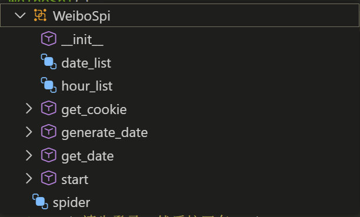
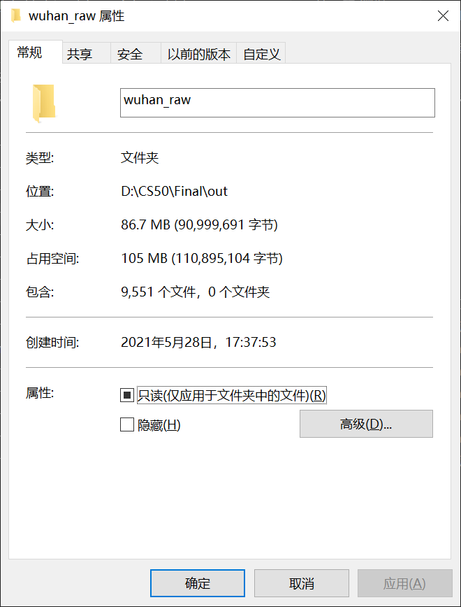
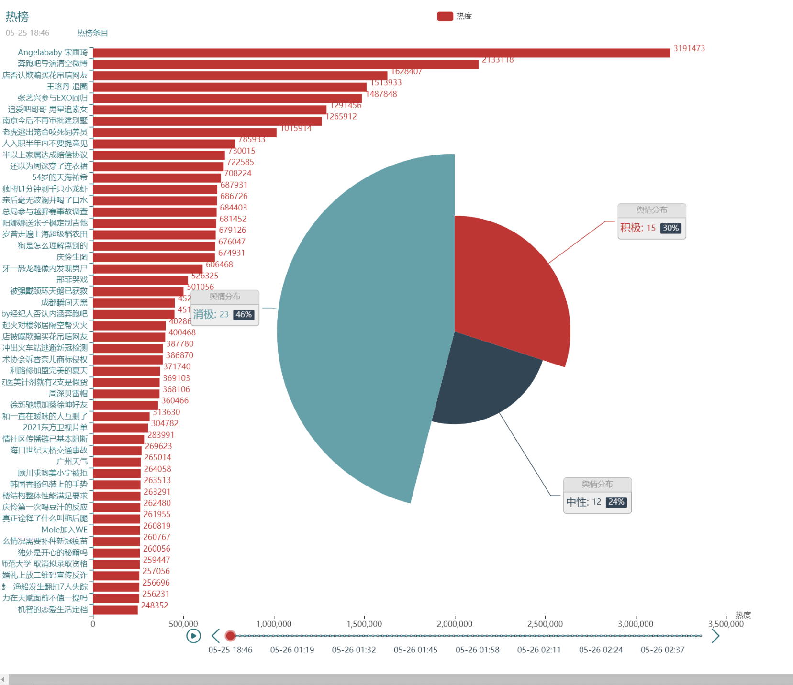
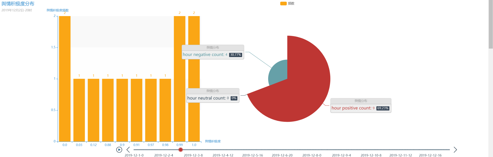
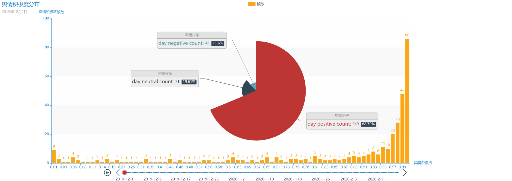
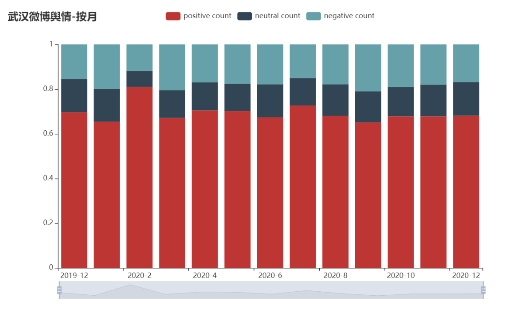
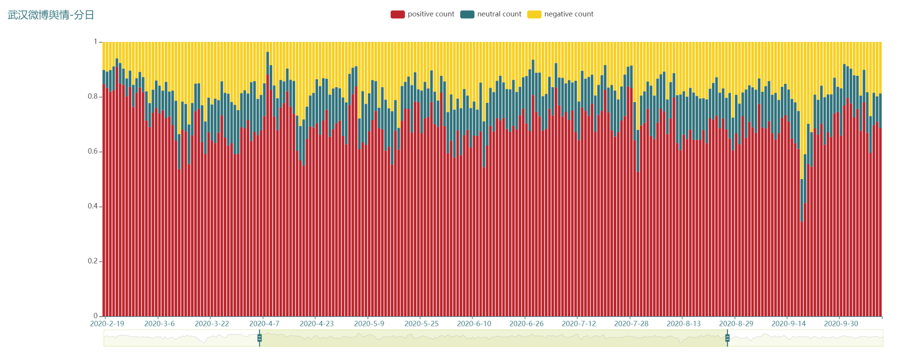
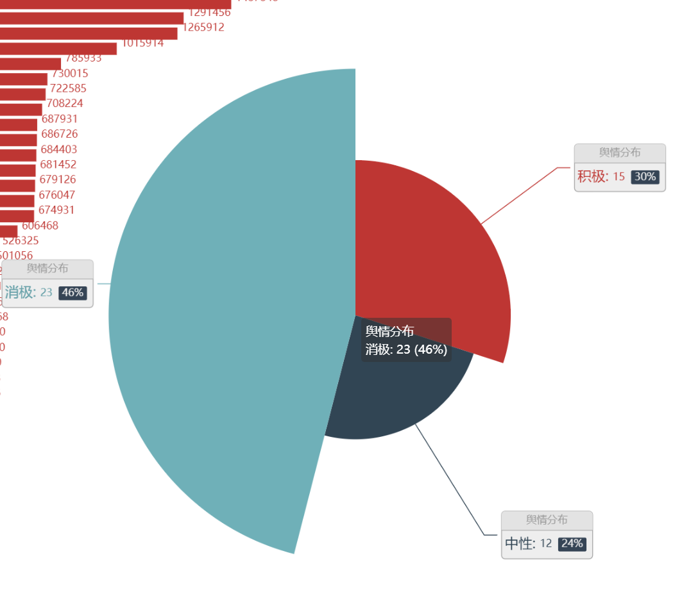

# WeiboSpi：一个简易微博爬虫框架

主要工作：是建立一个通用的微博采集工具。作为project实现疫情舆情和热榜跟踪的实例。

1. 在指定的年月区间进行指定关键词抓取，实例中对2019年12月初到2020年12月底的微博数据进行抓取，共约400天，每天24*15约400条，两年语料共约10099+117066=127165条。
2. 在服务器端部署爬虫进行微博热榜跟踪，对榜单进行动态可视化，共23609次抓取，收集到榜单名录及其对应的热度值共1180450条。raw文件保存在`./out/hotrank`中。
3. 对上述方案的语料均利用ERNIE模型进行情感识别，评定舆情积极性。结果存在`weibo_wuhan.db`的`hotrank_senti`和`byday_senti`表中。

代码的文件夹结构如下：
├───.vscode
├───assets
├───data
├───model
│   └───ernie-1.0
├───out
│   ├───hotrank
│   ├───wuhan_day
│   ├───wuhan_hour
│   ├───wuhan_raw
│   ├───wuhan_stat_day
│   ├───wuhan_stat_hour
│   └───wuhan_vis_day
├───tmp
├───visualization
└───__pycache__

- hotrank.py：部署在服务器端进行热榜跟踪
- mytool.py：进度条
- senta.py：封装的情感识别组件
- sentiment.py：文本预处理和情感识别函数
- vis_total.py：总的可视化脚本文件
- spider.py：爬虫对象类，框架文件
- archive.py：将数据存入数据库


## 历史微博数据长线抓取

我们实现了两个版本的爬虫，其中一个是专门用于实现实例的脚本文件位于others文件夹中。

主要的功能我们封装在`spider.py`的`WeiboSpi`类中



其中保存的数据包括date_list和hour_list，是将要爬取的目标时间节点的日期和小时。

可以进行自主cookies获取、按照年月数生成指定的目标时间节点、获取已有的目标时间节点，开始爬取。爬取的部分我们设置了有效的错误处理，保存已有的失败时间节点，进行反复爬取。

接口是很简单的，如下：

```python
if __name__ == "__main__":
    spider = WeiboSpi()
    # cookie和日期已经在实例中生成，因而可以直接跳过这两步，并直接登陆
    # spider.get_cookie()
    # spider.generate_date([2019,12], [2020,12])
    # spider.start('./out/wuhan_raw.txt')
    spider.start("./tmp") # 可以在tmp文件夹下进行简单的交互
```

> 由于此前爬取次数过多，所以在代码重构之后还没能成功运行大规模数据，如果为了更有效地爬取而不被反爬，可以尝试others文件夹下的`spider.py`，相关的数据也在其中给出.

爬取结果如下：



## 服务器端进行热榜追踪

在服务器端准备chrome：https://blog.csdn.net/jiatong151/article/details/102563946

查找python3安装位置：https://blog.csdn.net/MAOZEXIJR/article/details/105392787
服务器端定时运行：http://c.biancheng.net/view/1092.html

注意Ubuntu端对应的service名称为cron。

而后我们在VNC控制台中运行`hotrank.py`脚本程序，即可获得如下的文件：


我们已经转移到本地，见`./out/hotrank`。代码可视化如下：



见Summary.html的底部。

## 舆情监测

一次性打包进行微博的舆情分析。首先尝试使用了ERNIE的`TensorFlow`版本以及百度智能云，但可迁移性较差，最后我们使用了puddlehub给出的接口并封装

利用之前爬取的结果，进行三种模式的展示，计算按小时、按天的分类和的概率分布的动态变化图，按照月份的柱形或者折线图对比。









另外可以利用这个思路进行热榜即时的情感向分析，利用动态方法进行分析，每分钟50条，总共需要2000分钟，严格来说不到两天时间就可以获得10w+的数据。


