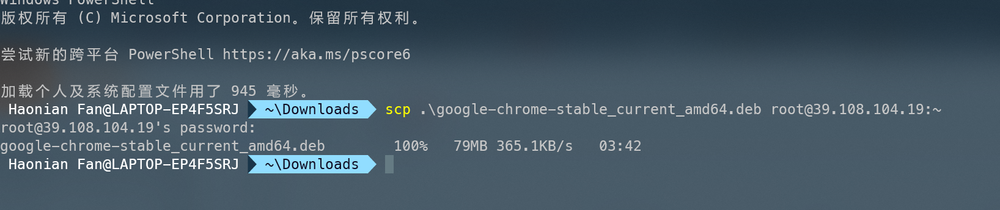

服务器配置：预计在网页端显示

在服务器端准备chrome：https://blog.csdn.net/jiatong151/article/details/102563946

查找python3安装位置：https://blog.csdn.net/MAOZEXIJR/article/details/105392787
服务器端定时运行：http://c.biancheng.net/view/1092.html

注意Ubuntu端对应的service名称为cron

## 舆情监测
一次性打包进行微博的舆情分析。
利用之前爬取的结果，进行三种模式的展示，计算按小时、按天的分类和的概率分布的动态变化图，按照月份的柱形或者折线图对比。
另外可以利用这个思路进行热榜即时的情感向分析，利用动态方法进行分析，每分钟50条，总共需要2000分钟，严格来说不到两天时间就可以获得10w+的数据。

