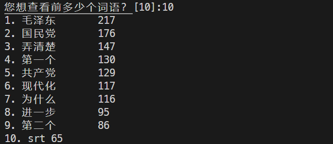

# 基于jieba分词的Python文本分析器
**Dev By** 范皓年 电子学系 1900012739
## 文本选取
课程选择了三国演义，属于小说，约64w字。

这里我们选择了两种文本，作为体裁的区分，我们选取口语式的讲稿。其语言特征和处理想法和长文大不相同。这里的讲稿我们选取了北京大学史纲mooc录音稿。

同时我们尝试了解GB级文本分析，出于作业的客观需要，我们选择了相对较长的《红楼梦》作验证，说明我们的大文本文件方法的正确性。

## 讲稿分析
>免责声明：这里的讲稿只作为程序设计学习交流使用，内容没有指向。

讲稿是一种相对口语化的文体，我们在这里简单地做一分析。

讲稿我们选用了北京大学史纲MOOC，为免责已经取消链接。

讲稿的获得与清洗见 [我的这篇博客](https://blog.csdn.net/weixin_45502929/article/details/106363436)，简要流程分如下几步：
1. 利用[Mooc_Downloader](https://github.com/PyJun/Mooc_Downloader)分节获取字幕文件。
2. 汇总.srt文件
3. 格式清洗
4. 脚本汇总到raw.txt

得到文本之后，直接输入处理器1.0（大体结构与课堂示例程序类似）：
```sh
Building prefix dict from the default dictionary ...
Dumping model to file cache C:\Users\abc44\AppData\Local\Temp\jieba.cache
Loading model cost 1.403 seconds.
Prefix dict has been built successfully.
经统计，共有12078个不同的词
您想查看前多少个词语？[10]:  
1. 我们 2290
2. 中国 1472
3. 这个 1040
4. 一个 877
5. 所以 858
6. 社会主义     591
7. 社会 543
8. 发展 516
9. 就是 483
10. 一些        461
已写入文件：./output.csv
```

观察csv，可以看到口语中更多无具体含义的字词。因而定义ignore list
```python
ignore_list =  ['我们', '这个', '一个', '所以', 
                '就是', '一些', '大家', '那么', 
                '可能', '什么', '非常', '这种',
                '就是说']
```

利用wordcloud库，我们可以将如上的分析结果呈现为如下的词云：

具体语句如下：
```py
wordcloud = WordCloud(
    # 生成中文字的字体,必须要加,不然看不到中文
    font_path="C:\Windows\Fonts\simhei.ttf"
).generate(cloud_material)
image_produce = wordcloud.to_image()
image_produce.show()
```

利用上述写法获得的词云图片无法自动保存并实现良好的裁边。这里我们采用matplotlib.pyplot库，重写上述显示模块。从而可以自动保存更优美的图片。
```py
fig = plt.figure(1)
plt.imshow(image_produce)
plt.axis('off')
# plt.show() # 如果加这一句那么不能存图片

plt.gca().xaxis.set_major_locator(plt.NullLocator())
plt.gca().yaxis.set_major_locator(plt.NullLocator())
plt.subplots_adjust(top = 1, bottom = 0, right = 1, left = 0, hspace = 0, wspace = 0)
plt.margins(0,0)
plt.savefig('./wordcloud.png', box_inches='tight')
```

但即便如此我们可以看到词云中有较多的无分析价值的词语，通过对词云的感性观察，我们猜想，口语中拥有更加丰富的琐碎词语。选取至少3字词语能获得更加有意义的。

更改之后，我们可以看到在前10的结果中，有意义词语的占比大大增加：


我们进一步尝试了限制为三字词语，结果如下：

可以看到的是，由于讲稿特有的口语属性，我们不能很好地滤出名字。经过资料查询我们发现这是现代汉语口语固有的属性，也是NLP的一个好课题。但我们不得不说，通过调整筛选长度确实可以很好地定向筛选目标。

## 大文件处理方法
使用with方法将文件表示为一个指针，随后分行读入，由于有python自带的缓冲机制IO，以及内存管理机制，所以我们可以仍然可以便利地操纵大文件。

同时经过查询，64位电脑的字符串可以存储约116G的文件，详见这个[Stack Overflow问题](https://stackoverflow.com/questions/1739913/what-is-the-max-length-of-a-python-string)。

所以结合这两方面，我们构建了异常简明但有效的大文件读取方式。示例代码如下：
```py
with open(txt_filename, 'r', encoding='utf-8') as f:
    for line in f:
        pass # do something
```

NLP拥有相当丰富的大数据语料库，比如，我们可以对其进行清洗之后读入并分词。

这里我们作为课程作业，没有必要将上G的文件打包到文件里，我们同样采用长篇小说为语料，作为这个方案的测试。

对于Python来说，《红楼梦》这样的小说（约70万字，1MB）算作小文件，可以直接读入操作，从而我们可以利用两种方式的对比来说明大文件读取的正确性。

结果得到：
```py
# 默认一次读入方法
宝玉,3760
什么,1613
一个,1452
贾母,1227
我们,1221
那里,1175
凤姐,1103
王夫人,1011
你们,1009
如今,999

# 大文件存取方法
宝玉,3760
什么,1613
一个,1452
贾母,1227
我们,1221
那里,1175
凤姐,1103
王夫人,1011
你们,1009
如今,999
```
这表明两种方法是等效的 ，这辅证了大文件读取方法的可行性。

## 代码重构
### 面向对象
我们为了实现脚本的复用，我们在原结构化程序的基础上进行重构，使用了面向对象结构。这使得我们的TextAnalyser可以作为一个自定义模块进行使用，同时可以更方便地被调用并同时进行多个文本分析。

### 筛选属性的存储
在analyse函数当中，我们将原有的字长、忽略词、同义词的筛选过滤方式进行封装。

其中忽略词列表和同义词词典都存入指定文件当中。列表通过每行一个元素存入txt文件当中，同义词典我们利用json格式进行存储。读写都可以直接利用json库进行，代码是非常简单的：
```py
with open('syno_dict.json', 'w', encoding='utf-8') as f:
    json.dump(syno, f, indent=2, ensure_ascii=False)

with open('syno_dict.json', 'r', encoding='utf-8') as f:
            self.syno_dict = json.load(f)
```

字长我们在文本分析器启动时指定，默认至少为2，通过这样的动态确定方式，我们可以在同一个程序的多次调用时筛选出不同字长的语词。

### 词性选择
即便有字长、词义等的有效选择，但之前我们还是在结果中看到了比较多的不满意词语。

由于人物是文本分析中的重要组成部分，所以我们通过`jieba.posseg`组件进行词性标注并将其中人名的词语过滤出来。

通过将lcut生成一个以pair为元素的列表，可以转为词典，通过查词典，我们将其中的词性对应关系表示出来从而完成筛选，结果如下：
```sh
您想查看前多少个词语？[10]: 20
位次    词语            词频
1       宝玉            3760
2       贾母            2193
3       王夫人          1836
4       凤姐            1573
5       黛玉            843
6       贾琏            673
7       宝钗            599
8       薛姨妈          453
9       探春            433
10      贾政            350
11      小丫头          287
12      邢夫人          284
13      贾珍            282
14      紫鹃            273
15      尤氏            225
16      明白            212
17      薛蟠            194
18      周瑞家          170
19      贾政道          170
20      言语            155
已写入文件：./output.csv
```

可以看到，过滤效果非常优良。

