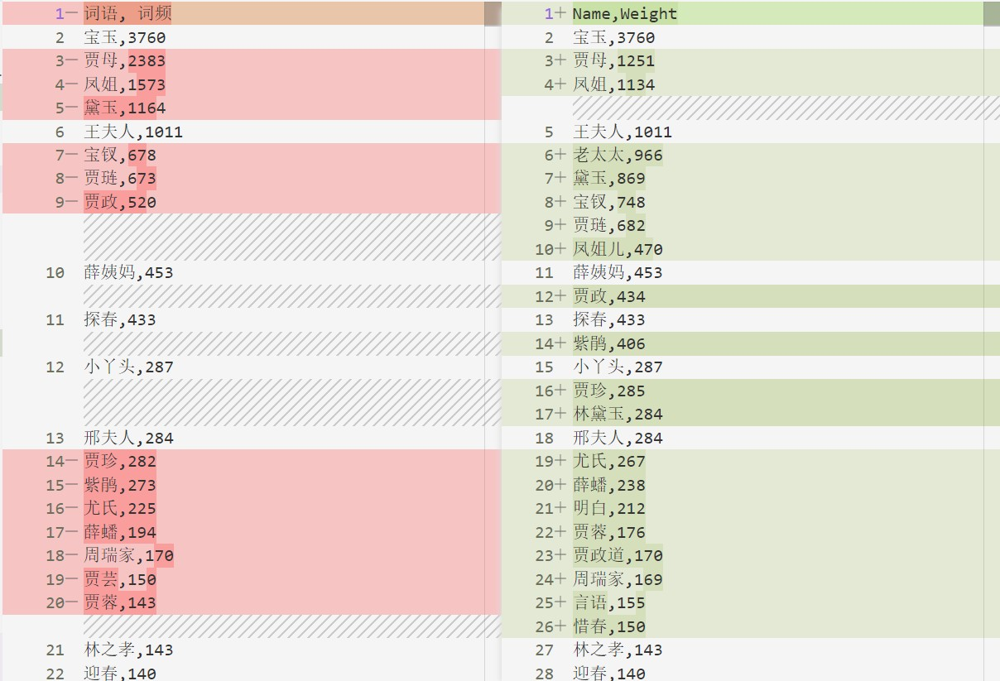
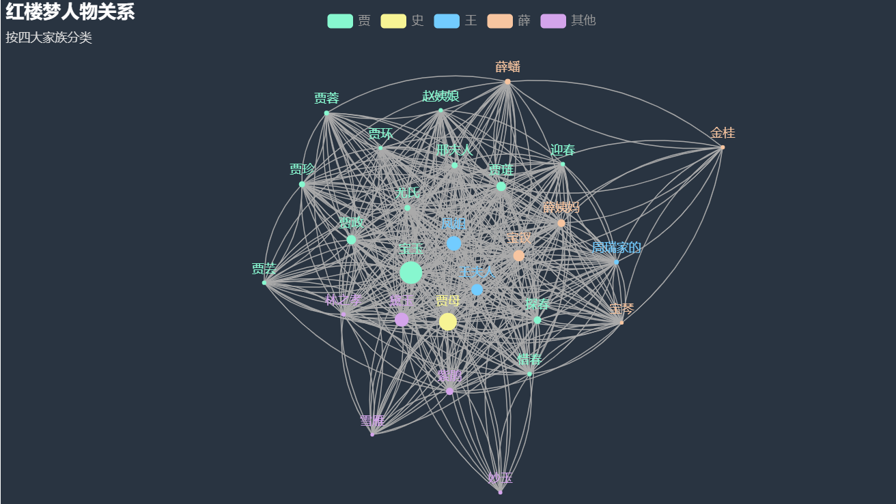

# 计算机科学与编程入门课程第三次作业
1. 选一部文学作品（可以是之前分析词频的作品），分析人物“共现”，生成关系图
2. 使用文本编辑器，用html设计一个网页，页面包含输入框和按钮，实现某个搜索引擎的搜索功能，可以直接用html实现，用bootstrap实现美观版式更好
3. 使用文本编辑器，设计一个网页，用CSS进行美化（以文本为主，适量配图）
4. 将上述三个网页放到github上个人主页空间，并在首页加链接和说明

我们预计使用之前在文本分析任务当中使用的红楼梦为研究文本，生成关系图。随后完成一个html练习，将这个关系图植入我们的网页当中，而后完成搜索引擎重定向任务，并使用bootstrap美化网页。

## 文本人物共现分析
直接将文本内容更换，而首先不考虑忽略词、同义词等问题，与我们在文本分析任务当中获得的列表进行对比。原理上讲，尽管这是一个迁移的过程，但是由于词性标注都基于jieba，所以得出的结果应当相同，我们首先进行对照：

第一版find_coocuur得到的任务节点结果（右）和文本分析器得到的结果对比如下。

简要进行对比，我们可以得到如下的主要修改意见：

1. 贾母、凤姐、黛玉过少，考虑增加在文本分析器中添加的同义词典（同义词）
2. 贾政道、周瑞家、贾母笑等词被不合理分词。（同义词）
3. 小丫头、言语、明白、冷笑等词并不明确指向某人，应当忽略（忽略词）
4. 宝二爷等相对生疏的昵称、“贾政听”等不合理的分词出现在100位以后（同义词）

此外我们还观察到一处不同，即此前的宝钗相对较少，而本次即便没有做同义词，也得到了更多的“宝钗”。经过代码比对，我们发现，此前的词性判断直接用了`!=`而这次使用了`in`，所以就一定程度上扩大了范围。

v1.1中我们加入了一些足够的同近义词，获得了比较好的收效。数据见`out/红楼梦-人物节点.csv`和`out/红楼梦-人物连接.csv`。

在人物关系绘图上，我们在原有示例代码的基础上做了如下几处改动：

1. 将html主题更换为CHALK，增加易读性。
2. 增大重力参数，使得整体布局更为紧凑。
3. 增加连接弧度，避免连接较少、权重较低的分支离群。

视觉效果如下：

