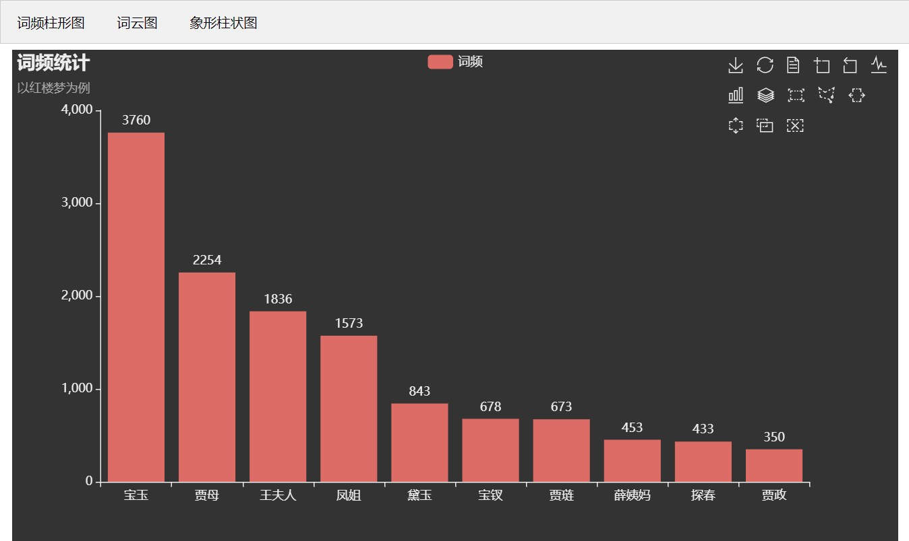
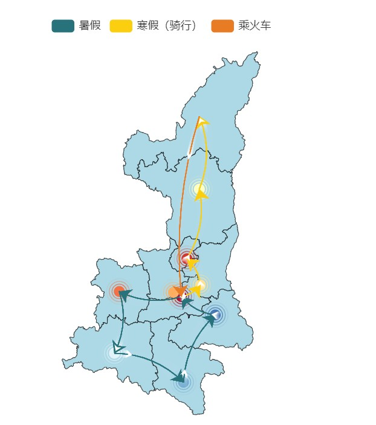
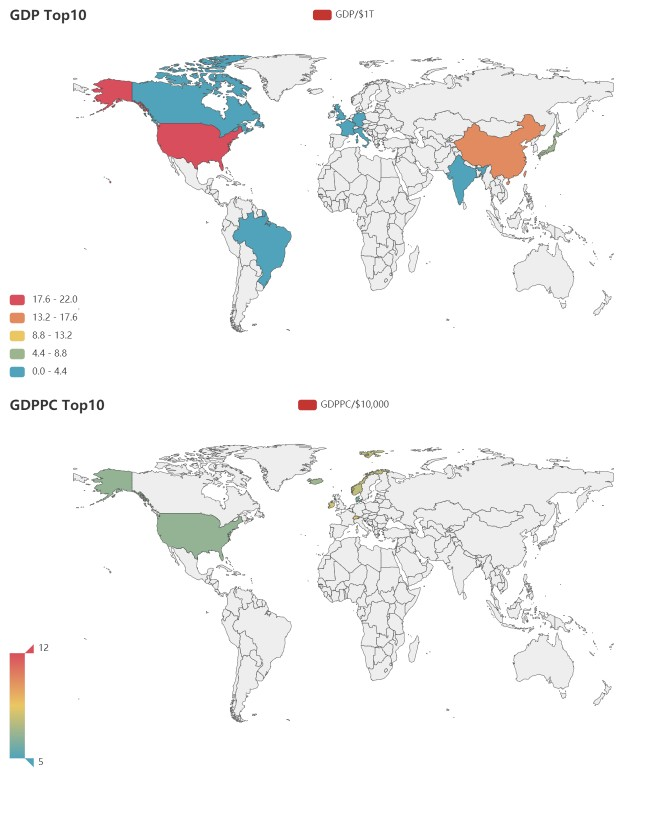
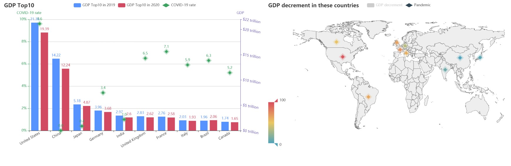

# 计算机科学与编程入门课程第二次作业
## 个人信息
|    学号    |  姓名  |
| :--------: | :----: |
| 1900012739 | 范皓年 |
## 作业1：词频统计图
### 描述
利用三种图形进行词频可视化

基于之前在文本分析中得到的结果，我们这里利用柱形图、词云图和象形柱状图进行数据可视化。

柱形图的绘制相对简单，要点是要选取合适的绘制范围，基于pyecharts，之后的操作都非常简单

首先绘制的图片过小，所以我们扩大了词频范围


但随后发现范围过大，致使整个图片铺满，出现了显著的长尾海洋+有效数据孤岛。


最终我们选用了前100个数据进行词云绘图。

另外补充了象形柱状图，同样用于表示量的关系。

利用pycharts.charts.Tab组织三个图样。如图



详情见代码仓库中的[wordfreq.html](./out/wordfreq.html)

### [作业1链接](./1_wordfreq.py)

## 作业2；地理连线图
### 描述
可视化作业2：地理坐标系图练习

利用pyecharts实现地图以及连线。

这个地图使用地理散点和连线两种基本图样描述了寒暑假旅行的大体路线。

这里的旅行示意图是按照省内GDP排名随机安插的整数值，并没有实在的意义

#### 故事背景：
```
一个漫长的寒假，内卷自学新知识累的半死的小h想在省内走一走，
从西安出发，ta本来想沿着全省来一次环省旅行，但是发现越往北走，气候越不好，所以ta打算尽可能往南走。
骑车或者轮滑都令人困倦。由于他的精力是有限的，他必须要用最低的成本走完越多的路程。
每一条路径的消耗都已经以list的形式给出，没有在图中给出。在一定的城市可以获得一定的补充。
由于你刚刚学会python，尝试编写一个程序帮他找到最佳的路径遍历陕南。注意：Floyd算法可能会超时。
```
>（手动狗头：这个程序和算法题毫无关联

#### 代码实现
实现方面没有特别困难的点，在示例代码的基础上，我们增加了特效和主题的更换，使渲染效果大大优化。如下


### [作业2链接]()

## 作业3：中国地图、世界地图
### 描述
可视化作业3：地图可视化练习

#### 故事背景：
利用这个地图，我们将2019年的世界GDP前十作一展示。

通过GDP Top10和GDPPC(pre capita, 人均国内生产总值)的对比，我们可以看出，世界上的GDP大国和GDPPC强国几乎正交。人均GDP高的国家往往是早期的发达国家。

与之相比，GDP大国往往却出现在当今的发展中国家，以中国为代表的一系列国家，以庞大的人口体量
带来了经济发展空间。

下一个任务我们将基于时间尺度进行。


#### 代码实现
我们将GDP数据存入json文件中，随后读取出来，并利用pyecharts相关组件进行地图绘制。

部分统计数据将中国澳门分开计算平均，这样的结果是，中国澳门也位列前十；但我们始终认为，港澳台是中国不可分割的一部分，所以统计数据中无澳门，采用至11名。

效果如下：



### [作业3链接](./3_map.py)

## 作业4：组合图表
### 描述
可视化作业4：组合图表练习


#### 故事背景：
我们选取了两个主题进行分析，试图从一个侧面反应疫情对世界经济的影响。

一个是疫情的感染率，来表征一个国家受到疫情的冲击程度。

另一方面我们选用了GDP的减量进行展示。

两相对比，我们发现，除美国外，其他国家大都有如下的特征：
1. 一类国家采用对疫情的强硬措施，以中国为代表，采用了相对强的休克性疗法，这样的结果是，有效地控制疫情，但是GDP减量较大
2.  一类国家采用保持经济的措施，以欧洲部分国家家为代表，一定程度上保持了经济稳定运行，但是不强力阻滞疫情发展，导致了较为严重的疫情

从这个比较当中我们不难看出中国为了保障人民的生命健康权益，所做出的重大牺牲。
#### 代码实现

这个在任务3的基础上加入了时间的考虑，但由于我们选取的事件是疫情相关，
所以时间线并不长，所以我们没有使用timeline结构。

共绘制如下四幅图，利用overlap和page绘制在同一个网页中。

1. GDP前十的两年GDP的并列柱形图
2. GDP前十国家的感染率
3. 世界疫情统计图
4. 世界GDP减量热图

效果如下：



### [作业4链接](./4_multi.py)

