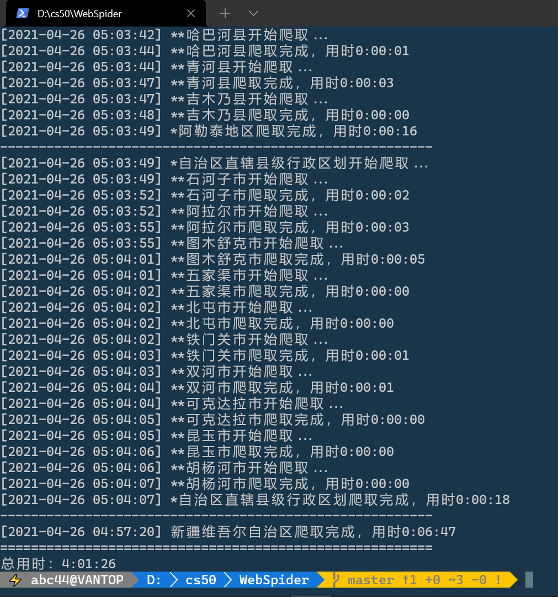
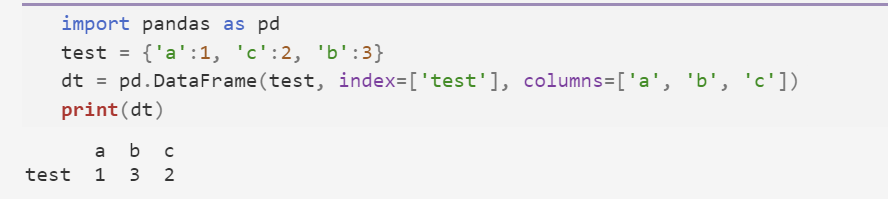
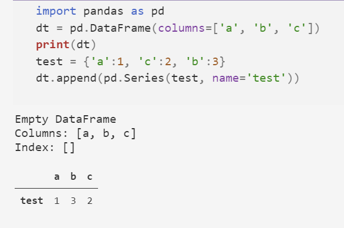

# Python爬虫练习

进入国家统计局[2020年统计用区划代码和城乡划分](http://www.stats.gov.cn/tjsj/tjbz/tjyqhdmhcxhfdm/2020/index.html)。以此为起点，自动爬取各省市自治区相应统计单位一直到最基层为止，以此为基础，对中国基层行政单位的名称进行统计分析。这样的分析此前已经存在，比如网易数读的文章《[我们分析了67万个村名，找到了中国地名的秘密](https://xw.qq.com/cmsid/20181204A18Y2Q00?f=dc)》。

## 数据获取

爬取后的输出格式如下图所示(没有到最基层，以此类推)。

每一级统计单位相对于上一级用\t缩进，最高一级为省市自治区。每个统计单位前为统计用区划代码。

最高一级的统计用区划代码为该区域前两位，后面依次补零。


最基层有“城乡分类代码”，将该代码放到名称之后，形如：“110112005001天赐良园社区居委会111”，其中的111为“城乡分类代码”。

将分层的文本数据储存到`StatData.txt`中

## 数据统计与分析

### task 1

“城乡分类代码”含义如下：“111表示主城区，112表示城乡结合区，121表示镇中心区，122表示镇乡结合区，123表示特殊区域，210表示乡中心区，220表示村庄”。分别统计各分类最基层统计单位数量格式如下：


省市名称顺序自定，间距自定或采用Tab。


### task 2

分别针对“内蒙古自治区”和“河南省”含有“村委会”的最基层统计单位，统计去除“村委会”后，最常用字前100个，观察其异同，输出按字的频率又高到低顺序输出；

### task 3

根据文后附属的姓氏排行，统计带有不同姓氏的地名数量。注意：仅统计第一个字，仅统计最低两个层次；输出按文后给出的姓氏顺序，格式为每行前一个字符串为姓氏，中间以Tab隔开，后面为该形式的地名数

```sql
01李 02王 03张 04刘 05陈 06杨 07赵 08黄 09周 10吴
11徐 12孙 13胡 14朱 15高 16林 17何 18郭 19马 20罗
21梁 22宋 23郑 24谢 25韩 26唐 27冯 28于 29董 30萧
31程 32曹 33袁 34邓 35许 36傅 37沈 38曾 39彭 40吕
41苏 42卢 43蒋 44蔡 45贾 46丁 47魏 48薛 49叶 50阎
51余 52潘 53杜 54戴 55夏 56钟 57汪 58田 59任 60姜
61范 62方 63石 64姚 65谭 66廖 67邹 68熊 69金 70陆
71郝 72孔 73白 74崔 75康 76毛 77邱 78秦 79江 80史
81顾 82侯 83邵 84孟 85龙 86万 87段 88漕 89钱 90汤
91尹 92黎 93易 94常 95武 96乔 97贺 98赖 99龚 100文
```

将上次三个小题的数据输出到`ComputingData.txt`


## 补充说明

可以使用多线程加速运行时间，但是考虑到反爬带来的不一致性我们最终没有采用。

## 代码实现
### 文件结构

实现了一个面向对象的程序，组件`parco`和主程序`get_data`，

`parco.py`中给出一个函数，每一个链接的调用返回一个`名称:链接`的字典。然后在`get_data`中实现递归调用。

由于要输出，所以我们考虑把层数加进去。这样就可以有机地调整输出。

由于诸多原因这个目标并未实现。后来我们不再使用面向对象的结构，而直接换用面向过程的代码，如`stat_spider.py`。


我们接下来的叙述也基于`stat_spider.py`


#### 文本内容和链接获取

```
<a href="11.html">北京市<br/></a>
```
的网页，不能直接从string属性当中获得标签对应的文本。

解决方法：删除不配对标签 https://blog.csdn.net/u012587107/article/details/80543977

或者使用get_text函数


得到省级的字典如下：

```json
{'北京市': '11.html', '天津市': '12.html', '河北省': '13.html', '山西省': '14.html', '内蒙古自治区': '15.html', '辽宁省': '21.html', '吉林省': '22.html', '黑龙江省': '23.html', '上海市': '31.html', '江苏省': '32.html', '浙江省': '33.html', '安徽省': '34.html', '福建省': '35.html', '江西省': '36.html', '山东省': '37.html', '河南省': '41.html', '湖北省': '42.html', '湖南省': '43.html', '广东省': '44.html', '广西壮族自治区': '45.html', '海南省': '46.html', '重庆市': '50.html', '四川省': '51.html', '贵州省': '52.html', '云南省': '53.html', '西藏自治区': '54.html', '陕西省': '61.html', '甘肃省': '62.html', '青海省': '63.html', '宁夏回族自治区': '64.html', '新疆维吾尔自治区': '65.html'}
```

随机开始进行递归调用。

由于省级没有对应编码，所以可以考虑单独处理。


#### 反爬？这里是HTML解析的问题

```
                130671000000保定高新技术产业开发区
                130672000000保定白沟新城
                130681000000涿州市
                130682000000定州市
                130683000000安国市
                130684000000高碑店市
        130700000000张家口市
        130800000000承德市
        130900000000沧州市
        131000000000廊坊市
        131100000000衡水市
140000000000山西省
150000000000内蒙古自治区
210000000000辽宁省
220000000000吉林省
230000000000黑龙江省
310000000000上海市
320000000000江苏省
330000000000浙江省
```

并不全是。似乎一个重要原因是后面的省市都换用了table结构。每一层当中的tr标签都具有相对鲜明的特征，这些使用CSS select非常容易选出。

html的结构对我们编写爬虫来说非常关键。

#### 对于特定问题过程化的好处

过程化可以减少对象的传递，比如在网页当中，两个链接并排时，我们可以两个两个处理它们，而不用考虑怎样构建更好的数据结构的问题。而直接将对应的tr中的td取出来就好。

另外我们没有认识到find_all返回的resultset是一个列表结构，最初只进行迭代遍历，吃了不少亏。

```python
item_href = item_td_code.get("href")
item_code = item_td_code.get_text()
item_name = item_td_name.get_text()
```

比如后来我们采用了如上的语句即可，由于每一条有效数据都对应着一个tr，编码和名称分别对应两个td，故而我们可以非常容易地筛选出来。


#### 异常处理：解决反爬
```python
def get_html(url):
    """
    # get_html
    @Description:
    get html code by url 
    based on exception handling and anti-spider design 
    to realize totally data mining
    ---------
    @Param:
    a url str
    -------
    @Returns:
    a Beautifulsoup object
    GBK encoding and html.parser as resolver.
    -------
    """
    while True:
        try:
            response = requests.get(url, timeout=1) # set appropriate timeout to reduce the possibilities of anti-spider
            response.encoding = "GBK"
            if response.status_code == 200: # if access successfully
                return BeautifulSoup(response.text, "html.parser")
            else:
                continue
        except Exception:
            # if we add a print here, we could see that it actually fail somtimes
            continue

```
我们在输出中发现了诸如连续的1。后来确定，达到timeout之后确实会触发异常。

如果这时候我们在异常处理分支添加一个输出，那么我们将会发现超时是不时发生的，这时候我们重新开始爬取即可。进入while循环

#### 计时分析


由于数据量极大，我们添加了log简单对比了几个平台之下的速度（1分钟）：
```
powershell：2959
vscode：2187
wsl linux:2648
cmd: 3126
```



### 统计分析

共679237行

通过一次性遍历，把每个省的数据统计出来：

#### task 1

```pseudocode
（利用缩进判断）
如果是一个省/直辖市:
	计数开始
否则：
	遍历基层并计数

统一显示：
	利用dataframe存储之后输出是比较方便的
```

注意，基层不一定是五层。我们应当通过最后三位数进行判断是否为基层。

了解：

- dataframe的创建：https://blog.csdn.net/qq_42067550/article/details/106148799
- dataframe基于dict添加：https://blog.csdn.net/ningyanggege/article/details/93331542
- dataframe.append(pd.Series)：https://blog.csdn.net/sinat_29957455/article/details/84961936（使用这个方法才能重新命名index）
- dataframe输出：https://blog.csdn.net/qq_27133869/article/details/103709805





#### task 2

```pseudocode
如果是河南或者内蒙古：
	判断基层：
		如果是村委会：
			统计字频
去掉“村”“委”“会”
显示
```

利用dict进行统计

#### task 3

统计一个词典的词频：https://ask.csdn.net/questions/761132

```
读入词语
遍历词语中的单字:
	如果在要找的百家姓中:
		计数
	否则
```

词典的key可以作为是否查询的判据，用于判断一个词典是否为空，以及一个变量是否作为key出现在这个dict中。

由于需要判断倒数第二深层，其中部分地方只有四层，所以这个判断的行为也并不是统一的。这里我们考虑，基层的父层是倒数第二层。所以先将上一层的名称保存下来，如果进入了基层区域，那么上一条记录就必然是倒数第二层。

#### 需要定义的组件函数

判断是否是一个省级单位`is_prov`

判断是否是基层`is_base`

提取名称的函数`place_name`