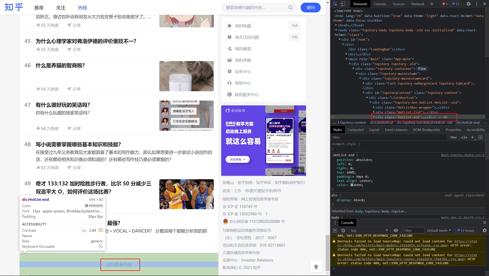

# 基于 Selenium 的爬虫

> 计算机科学与编程入门第四次作业

范皓年 1900012739 电子学系

## 任务描述

1. 用手工登录配合的方法，获取登录知乎的 cookies ，供后续使用 cookies 保存在“./data/my_cookies.json”，后续程序使用时也指向这个位置，以便核查时更换其他 cookies 这是一个单独的程序，和后续程序可以各自独立运行
2. 使用已有的 cookies ，用 selenium 库登录知乎，抓取热榜话题和对应的热度值。

基于如上任务，我们做出如下`1_get_cookies.py`和`2_hot_track.py`两个文件，分别对应两个指定任务。

## 项目实现

### 任务 1

基于第八讲中的`get_cookie_taobao.py`，将其中对应的网站更改为知乎即可。注意将 json 文件输出到 data 中。

### 任务 2

将任务1中得到的cookies装入程序，随后利用selenium进入网站即可。

注意：同示例程序`04_2_use_cookie_taobao.py`和第七讲的`04_1_sel_pq_jd.py`中不同的是，等待选项需要自己另行构建，之前我们使用了查找按钮上文字的方法，这里我们观察到，热榜共50条，最下部有一个class为HotList-end的元素。



我们等待其加载好即可。但是在选择过程当中，我们遇到了一些麻烦，

```python
wait.until(EC.presence_of_element_located(
    (By.XPATH, '//div[@class="HotList-end"]')), message="wait hotlist loading")  # 等待页面底部的当前页码出现
```

在实现过程当中，我们本来想使用id或name等方法直接查找，但经常页面没有 id，name 这些属性值，而class name 重复性较高，link 定位有针对性，所以 Xpath 与 Css 定位更灵活些，见如下两篇博客中所述。

https://www.cnblogs.com/minieye/p/5803640.html

https://blog.csdn.net/qq_32189701/article/details/100176577


具体爬取过程中，我们遇到了一些小麻烦，比如top3的class和后续元素的class不一定相同。

```
[<div class="HotItem-rank HotItem-hot">1</div>]
[<div class="HotItem-rank HotItem-hot">2</div>]
[<div class="HotItem-rank HotItem-hot">3</div>]
[<div class="HotItem-rank">4</div>]
[<div class="HotItem-rank">5</div>]
[<div class="HotItem-rank">6</div>]
[<div class="HotItem-rank">7</div>]
[<div class="HotItem-rank">8</div>]
[<div class="HotItem-rank">9</div>]
[<div class="HotItem-rank">10</div>
```

我们最先开始使用`HotItem-rank HotItem-hot`整个作为类名查找，发现甚至不能找出前三个。但是后面的都可以通过 HotItem-rank 作为 class 名筛选出来。

## 文件结构

assets为README.md中的图片保存库。

data保存着cookie。

output中zhihu_hot.png和zhihu_login.png分别为程序测试截图，是热榜界面和登陆界面。hot.txt的热榜信息。


